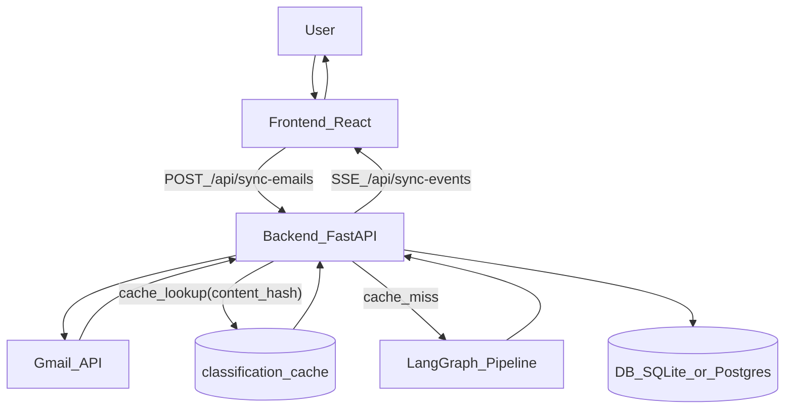
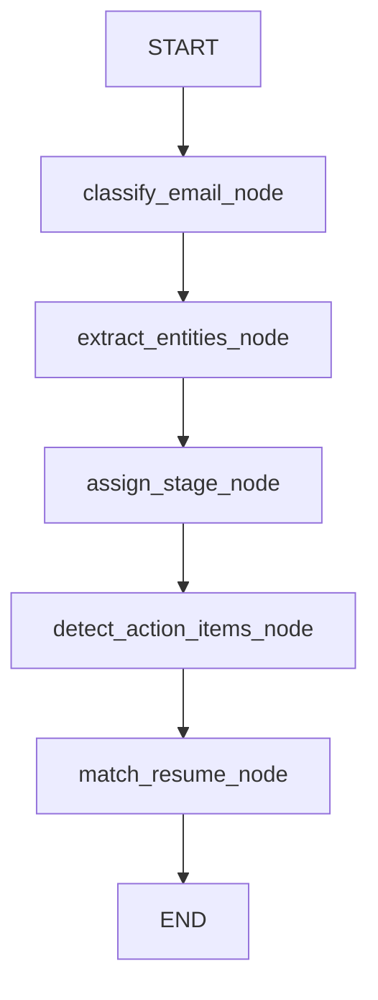

# Job Application Tracker (Email Jobs Tracker)

Track job applications by syncing Gmail (history-based incremental sync), classifying emails with AI (LangGraph pipeline + cache), and viewing analytics. Real-time sync progress via SSE; optional JWT or API key auth.

---

## Table of contents

- [Overview](#overview)
- [Architecture](#architecture)
- [Tech stack](#tech-stack)
- [Project structure](#project-structure)
- [Database schema](#database-schema)
- [Environment variables](#environment-variables)
- [Prerequisites](#prerequisites)
- [Quickstart (local)](#quickstart-local)
- [Setup](#setup)
- [Sync modes and Gmail auth](#sync-modes-and-gmail-auth)
- [Reprocessing (re-run LangGraph on existing rows)](#reprocessing-re-run-langgraph-on-existing-rows)
- [API reference](#api-reference)
- [Analytics](#analytics)
- [Testing](#testing)
- [Deployment notes](#deployment-notes)
- [Troubleshooting](#troubleshooting)
- [Runbook: Reset all user data](#runbook-reset-all-user-data)
- [Migration and security](#migration-and-security)
- [License](#license)

---

## Overview

- **Purpose:** Ingest job-related emails from Gmail, classify them (rejection, interview request, assessment, offer) with AI, store applications in a database, and provide funnel/response-rate/time-to-event analytics plus a simple success-prediction model.
- **Flow:** Gmail OAuth in browser → sync (full or incremental) → fetch messages → classify (OpenAI + cache) → persist to DB → expose via REST + SSE progress.

---

## Architecture

### Components

| Component | Role |
|-----------|------|
| **FastAPI backend** | REST API, Gmail OAuth redirect, sync orchestration, SSE stream |
| **Gmail service** | History API for incremental sync; search + pagination for full sync; rate limit/backoff |
| **Email processor** | Fetches messages, dedupes, runs classification (cache + LangGraph), writes to DB |
| **LangGraph pipeline** | Multi-node flow that produces `email_class` + entities + stage + action items |
| **Job title extraction helper** | Deterministic title candidate extraction + cleaning + fallback when the model returns `null` |
| **Sync state** | In-memory progress (processed/total/message) for `/sync-status` and SSE; DB state (historyId, last_synced_at) for incremental |
| **Celery (required for reprocess)** | Used by `/api/reprocess/*` to re-run LangGraph on existing rows (requires Redis). Email sync (`/api/sync-emails`) currently runs via FastAPI `BackgroundTasks`. |
| **Frontend** | React + Vite; lists applications, triggers sync, shows SSE progress; analytics dashboard |

### Data flow

1. **Auth:** Authenticated user opens `/api/gmail/auth` (or `/api/gmail/auth?token=<JWT>` in a browser) → OAuth flow → token stored per-user (recommended: `TOKEN_DIR/token_<user_id>.pickle`). Backend checks credentials are “ready for background” before starting sync.
2. **Sync start:** `POST /api/sync-emails?mode=auto|full|incremental` → background task starts.
3. **Sync execution:**  
   - **Auto:** If no historyId or no applications yet → full sync; else incremental (history).  
   - **Full:** Gmail search (subject/from) with pagination; optional `gmail_full_sync_after_date` / `gmail_full_sync_days_back` / `gmail_full_sync_ignore_last_synced`.  
   - **Incremental:** Gmail history API from stored `last_history_id`.  
   Emails are fetched first; only after the fetch phase, classification runs and results are written to `applications` and `email_logs`.
4. **Progress:** In-memory state updated (processed, total, message); clients poll `/api/sync-status` or subscribe to `/api/sync-events` (SSE) until status is `idle` or `error`.
5. **Analytics:** Funnel, response-rate (by company/industry), time-to-event (rejection/interview), and prediction endpoint read from `applications` (and related tables as needed).

---

### System diagrams

#### Sync + classification flow (high-level)



#### LangGraph pipeline (conceptual)



### Job title extraction (why titles stopped being `null`)

When the model returns a missing/`null` job title, the backend now attempts a safe fallback:

- **Candidate mining**: extract plausible titles from subject/body using common patterns (applied-flow and recruiter outreach).
- **Cleaning**: strip wrappers like `Role:` / `Position:` and suffixes like `at <Company>`, and remove requisition tokens (e.g. `Req #A-123`).
- **Plausibility checks**: reject URLs/sentences/boilerplate.
- **Selection**: prefer the model’s output if plausible; otherwise use the top-ranked candidate.

## Tech stack

- **Backend:** FastAPI (Python), Gmail API (history + search), OpenAI (LangGraph + structured JSON), SQLAlchemy (SQLite/PostgreSQL), Alembic (migrations), Celery + Redis (optional async jobs), SSE (sync progress)
- **Frontend:** React, Vite, Recharts, Axios
- **Auth:** JWT (HS256) or static API key in header. **Auth must be configured**: set `SECRET_KEY` (JWT) or set `API_KEY` **and** `API_KEY_USER_ID` (API key maps to a specific user). No anonymous mode in production.

---

## Project structure

```
├── backend/
│   ├── app/
│   │   ├── main.py              # FastAPI app, CORS, routers
│   │   ├── config.py            # Settings from .env
│   │   ├── database.py          # Session, init_db
│   │   ├── models.py            # Application, EmailLog, SyncMetadata, SyncState, Company, ClassificationCache
│   │   ├── schemas.py           # Pydantic request/response models
│   │   ├── auth.py              # JWT + API key, get_current_user
│   │   ├── gmail_service.py     # Gmail API, history, pagination, rate limit
│   │   ├── langgraph_pipeline.py # LangGraph pipeline: class → entities → stage → actions
│   │   ├── job_title_extraction.py # Deterministic job title candidates + cleaning
│   │   ├── email_classifier.py  # Legacy structured LLM (kept for compatibility; shares title extractor)
│   │   ├── sync_state.py        # In-memory sync progress
│   │   ├── sync_state_db.py    # DB sync state (historyId, etc.)
│   │   ├── celery_app.py       # Celery app (broker = Redis)
│   │   ├── tasks.py             # Celery sync task
│   │   ├── routers/
│   │   │   ├── applications.py  # /stats, /applications, /applications/{id}, schedule, respond
│   │   │   ├── sync.py          # /gmail/auth, /sync-emails, /sync-status, /sync-events
│   │   │   ├── analytics.py     # /funnel, /response-rate, /time-to-event, /prediction
│   │   │   ├── langgraph.py     # /api/langgraph/* (debug/reprocess endpoints)
│   │   │   └── auth_router.py  # /login
│   │   └── services/
│   │       ├── email_processor.py    # run_sync_with_options, fetch + classify + persist
│   │       └── classification_service.py
│   ├── alembic/                 # Migrations
│   ├── tests/
│   ├── requirements.txt
│   ├── run.sh                   # uvicorn app.main:app --reload --host 0.0.0.0 --port 8000
│   └── .env                     # Secrets (do not commit)
├── frontend/
│   └── src/
│       ├── App.jsx
│       ├── main.jsx
│       └── index.css
└── README.md
```

---

## Database schema

### Tables

| Table | Purpose |
|-------|---------|
| **applications** | One row per classified job email: company_name, status, category, job_title, confidence, email_* fields, received_date, transition timestamps; plus LangGraph fields like `classification_reasoning`, `position_level`, `application_stage`, `requires_action`, `action_items`, and processing metadata like `processed_by`. `gmail_message_id` is unique per user. |
| **email_logs** | Processed Gmail message IDs, processed_at, classification, error (for idempotency/debug). |
| **sync_metadata** | Key-value (e.g. last_synced_at) for backward compatibility. |
| **sync_state** | last_history_id, last_synced_at, last_full_sync_at, status (idle/syncing/error), error, updated_at. |
| **companies** | canonical_name, aliases (JSON), industry. |
| **classification_cache** | content_hash (unique) → cached classification state (`raw_json`) plus selected fields for quick lookup. Used to avoid re-running the model on the same email content. |
| **resumes** | Resume metadata for future matching to applications (Drive file id/version/etc.). |

### Indexes (applications)

- `ix_applications_category_received_date`
- `ix_applications_status_received_date`
- `ix_applications_received_date`
- Plus indexes on id, gmail_message_id, company_name, category, subcategory, job_title.

---

## Environment variables

Create `backend/.env` (do not commit). All settings are read via `config.Settings` (pydantic-settings from `.env`).

Notes:

- **Case-insensitive**: settings keys are not case-sensitive. Examples below use `UPPER_SNAKE_CASE`, but `database_url` works too.
- **Do not paste secrets into the README**: treat `.env` as sensitive and keep it out of git history.

| Variable | Default | Description |
|----------|---------|-------------|
| **Database** | | |
| `DATABASE_URL` | `sqlite:///./job_tracker.db` | SQLAlchemy URL (SQLite or Postgres). |
| `SUPABASE_SSL_CA_FILE` | (none) | Optional CA bundle path for Supabase/managed Postgres SSL verification (relative paths resolve under `backend/`). |
| `DB_POOL_SIZE` | `5` | SQLAlchemy pool size (Postgres only). |
| `DB_MAX_OVERFLOW` | `10` | SQLAlchemy max overflow (Postgres only). |
| `DB_POOL_TIMEOUT_S` | `30` | Pool checkout timeout (seconds). |
| `DB_POOL_RECYCLE_S` | `1800` | Pool recycle interval (seconds). |
| `SQLITE_BUSY_TIMEOUT_MS` | `5000` | Busy timeout for SQLite concurrency. |
| **Gmail OAuth (sync)** | | |
| `CREDENTIALS_PATH` | `credentials.json` | Path to Google OAuth client JSON (relative to `backend/` or absolute). |
| `TOKEN_DIR` | `gmail_tokens` | **Required for multi-user safety:** directory to store per-user Gmail OAuth tokens as `token_<user_id>.pickle` (relative to `backend/` or absolute). Set to `/data/gmail_tokens` in containers for persistence. |
| `TOKEN_PATH` | `token.pickle` | **Legacy (single-user only):** path to store a single Gmail OAuth token (file is written with `0o600`). If `TOKEN_DIR` is set, this is ignored for Gmail sync. |
| `GMAIL_OAUTH_REDIRECT_URI` | (none) | If set, `/api/gmail/auth` uses a redirect-based OAuth flow with CSRF `state` and callback at `/api/gmail/callback` (e.g. `https://<your-domain>/api/gmail/callback`). Add this exact URI to your Google OAuth client’s redirect URIs. |
| `GMAIL_CREDENTIALS_JSON` | (none) | **(Railway/containers)** Paste the full contents of `credentials.json` here; the container entrypoint writes it to `CREDENTIALS_PATH` at startup. |
| **AI** | | |
| `OPENAI_API_KEY` | `""` | Required for LLM classification. |
| `OPENAI_MODEL` | `gpt-4o-mini` | OpenAI model name used by LangGraph pipeline. |
| `OPENAI_TEMPERATURE` | `0.2` | Sampling temperature for the model. |
| **CORS** | | |
| `CORS_ORIGINS` | `["http://localhost:3000", "http://localhost:5173"]` | Allowed origins (JSON array). |
| **Redis / Celery** | | |
| `REDIS_URL` | `redis://localhost:6379/0` | Redis URL (Celery broker/backend; also used as L1 classification cache). **On Railway, do not use localhost**—use the Redis service connection URL. |
| `CELERY_BROKER_URL` | (uses `REDIS_URL`) | Override Celery broker URL. |
| **Auth (API)** | | |
| `SECRET_KEY` | `""` | JWT signing key. Required for `POST /api/login` and Bearer JWT auth. |
| `API_KEY` | `""` | Optional static API key (header auth). |
| `API_KEY_USER_ID` | (none) | **Required when using `API_KEY`**. API key resolves to this user id (multi-user safe). |
| `API_KEY_HEADER` | `X-API-Key` | Header name for API key. |
| `JWT_ALGORITHM` | `HS256` | JWT algorithm. |
| `JWT_EXPIRE_MINUTES` | `10080` | JWT expiry in minutes (7 days). |
| **Google OAuth (Sign in with Google)** | | |
| `GOOGLE_CLIENT_ID` | `""` | OAuth client id for the app’s “Sign in with Google” flow (separate from Gmail OAuth client JSON). |
| `GOOGLE_CLIENT_SECRET` | `""` | OAuth client secret for the app’s “Sign in with Google” flow. |
| `GOOGLE_REDIRECT_URI` | (none) | Redirect URI for Google login callback (e.g. `http://localhost:8000/api/auth/google/callback`). |
| **Gmail limits / full sync** | | |
| `GMAIL_HISTORY_MAX_RESULTS` | `100` | History API batch size. |
| `GMAIL_MESSAGES_MAX_RESULTS` | `100` | Messages per request. |
| `GMAIL_SYNC_PAGE_SIZE` | `100` | Pagination page size. |
| `GMAIL_FULL_SYNC_MAX_PER_QUERY` | `2000` | Max emails to fetch per query during full sync. |
| `GMAIL_FULL_SYNC_AFTER_DATE` | (none) | Override “after” date for full sync (YYYY/MM/DD or YYYY-MM-DD). |
| `GMAIL_FULL_SYNC_DAYS_BACK` | `90` | Days back for full sync when no override date. |
| `GMAIL_FULL_SYNC_IGNORE_LAST_SYNCED` | `false` | If true, ignore `last_synced_at` during full sync and use `after_date/days_back`. |
| **Ingestion + classification tuning** | | |
| `CLASSIFICATION_MAX_CONCURRENCY` | `15` | Max concurrent LLM calls (rate-limit protection). |
| `CLASSIFICATION_BATCH_SIZE` | `10` | Emails per LLM batch call (0 disables batching). |
| `CLASSIFICATION_USE_BATCH_PROMPT` | `true` | Enable batch prompting. |
| `CLASSIFICATION_BATCH_CONFIDENCE_THRESHOLD` | `0.6` | Low-confidence “important” emails are reprocessed individually. |
| `INGESTION_WORKERS` | `6` | Worker threads used to run LangGraph calls. |
| `INGESTION_BATCH_SIZE` | `25` | Emails per batch shard assigned to a worker. |

---

## Prerequisites

- **Python**: 3.10+ recommended
- **Node**: 18+ recommended (Vite + React)
- **Google Cloud**: Gmail API enabled + OAuth client JSON for Gmail sync
- **Redis**: required if you use Celery reprocessing (and beneficial for cache)

---

## Quickstart (local)

```bash
# Backend
cd backend
python3 -m venv .venv
source .venv/bin/activate
pip install -r requirements.txt

# Apply migrations
alembic upgrade head

# Run API (http://localhost:8000)
./run.sh
```

In another terminal:

```bash
# Frontend (http://localhost:5173)
cd frontend
npm install
npm run dev
```

Then:

- Get a JWT (`POST /api/login`) and open **`GET /api/gmail/auth?token=<JWT>`** once in your browser to grant Gmail access
- Use the UI to trigger sync, or call `POST /api/sync-emails`

---

## Quickstart (Docker)

This brings up **Postgres + Redis + backend + Celery worker + frontend**.

1. Ensure you have a Google OAuth client JSON at `backend/credentials.json` (not committed).
2. Export required env vars (or put them in a local `.env` file next to `docker-compose.yml`):
   - `OPENAI_API_KEY`
   - `SECRET_KEY` (recommended) or `API_KEY`
3. Start the stack:

```bash
docker compose up --build
```

Open the app at `http://localhost:5173`.

**Gmail OAuth in Docker**: the compose config sets `GMAIL_OAUTH_REDIRECT_URI` to `http://localhost:8000/api/gmail/callback`. Add that redirect URI to your Google Cloud OAuth client, then open `http://localhost:8000/api/gmail/auth?redirect_url=http://localhost:5173`.

Note: `/api/gmail/auth` requires auth; in a browser use `?token=<JWT>`:
`http://localhost:8000/api/gmail/auth?token=<JWT>&redirect_url=http://localhost:5173`

---

## Setup

### Backend

1. From project root:
   ```bash
   cd backend
   python3 -m venv .venv
   source .venv/bin/activate   # Windows: .venv\Scripts\activate
   pip install -r requirements.txt
   ```

2. **Environment:** Create `backend/.env` and set at least:
   - `OPENAI_API_KEY` — required for email classification
   - `DATABASE_URL` — optional (default SQLite)
   - `SECRET_KEY` (JWT) and/or `API_KEY` (header auth) — required for protected routes (sync, apps, analytics, reprocess)
   - `REDIS_URL` — required if you use Celery reprocessing; also used for the L1 classification cache

3. **Gmail OAuth:** Place Google OAuth client JSON at `backend/credentials.json` (APIs & Services → Credentials → OAuth 2.0 Client ID → download JSON). Then open **`GET /api/gmail/auth`** in a browser to authorize; after that, sync can run in the background.

4. **Migrations:**
   ```bash
   cd backend
   alembic upgrade head
   ```

5. **Run API:**
   ```bash
   chmod +x run.sh
   ./run.sh
   ```
   API: http://localhost:8000 — Docs: http://localhost:8000/docs

6. **Optional — Celery worker** (async sync; otherwise sync runs in-process):
   ```bash
   celery -A app.celery_app worker -l info
   ```
   Ensure Redis is running (`redis-server`).

### Frontend

```bash
cd frontend
npm install
npm run dev
```

App: http://localhost:5173 (proxies `/api` to backend).

---

## Sync modes and Gmail auth

- **Auto (`mode=auto`):** If there is no stored historyId or no applications yet, runs a **full** sync; otherwise runs **incremental** (Gmail history). Default for `POST /api/sync-emails`.
- **Full (`mode=full`):** Gmail search by subject/from, paginated; respects `GMAIL_FULL_SYNC_*` (max per query, after date, days back, ignore last_synced).
- **Incremental (`mode=incremental`):** Uses `sync_state.last_history_id` and Gmail history API.

**Gmail auth:** Sync must have valid OAuth credentials. The backend checks “credentials ready for background” before starting. If not, it returns 400 and tells the user to open **`GET /api/gmail/auth`** in the browser.

- **Redirect after consent (recommended):** `GET /api/gmail/auth?redirect_url=https://<your-domain>`
- **Production default:** if `redirect_url` is omitted, the backend redirects to the current request origin.
- **Redirect-based OAuth (recommended for Railway/containers):** set `GMAIL_OAUTH_REDIRECT_URI=https://<your-domain>/api/gmail/callback` and add it to the OAuth client redirect URIs in Google Cloud.

---

## Reprocessing (re-run LangGraph on existing rows)

Reprocessing is meant for “fix-ups” after prompt/model/schema changes (e.g. add new extracted fields, recompute `needs_review`, improve job title extraction, etc.).

- **How it runs**: via **Celery** (`/api/reprocess/start` enqueues a job; progress is stored in the `reprocess_state` table).
- **Requirements**: Redis + a running Celery worker.

Start a worker:

```bash
cd backend
source .venv/bin/activate
celery -A app.celery_app worker -l info
```

Then call:

- `POST /api/reprocess/start`
- Poll `GET /api/reprocess/status` until `status` becomes `idle` or `error`

---

## API reference

Base URL: `http://localhost:8000`. Auth: `Authorization: Bearer <JWT>` or `X-API-Key: <key>` when configured.

### Applications

| Method | Path | Query / Body | Description |
|--------|------|--------------|-------------|
| GET | `/api/stats` | — | Application counts (total, rejections, interviews, assessments, pending, offers). |
| GET | `/api/applications` | `status`, `offset`, `limit` (default 50, max 100) | Paginated list; `status` filters by category (e.g. REJECTION, INTERVIEW_REQUEST) or omit for all. |
| GET | `/api/applications/{id}` | — | Single application details. |
| POST | `/api/applications/{id}/schedule` | Body: `calendar_event_at`, `title`, `description` | Placeholder for calendar scheduling. |
| POST | `/api/applications/{id}/respond` | Body: `message`, `template` | Placeholder for sending a reply. |

### Sync

| Method | Path | Query / Body | Description |
|--------|------|--------------|-------------|
| GET | `/api/gmail/auth` | Optional: `redirect_url` | Redirects to Gmail OAuth; after consent, redirects to `redirect_url` (or current request origin). **Redirects are restricted** to same-origin or `CORS_ORIGINS`. When `GMAIL_OAUTH_REDIRECT_URI` is set, uses CSRF state. |
| GET | `/api/gmail/callback` | `code`, `state` (from Google) | OAuth callback when `GMAIL_OAUTH_REDIRECT_URI` is set; validates state and exchanges code for token. |
| POST | `/api/sync-emails` | Query: `mode=auto\|incremental\|full` | Start sync in background; returns immediately. |
| GET | `/api/sync-status` | — | Current sync progress for this user: status, message, processed, total, created, skipped, errors, error. |
| GET | `/api/sync-events` | Optional: `token` (for SSE without custom headers) | SSE stream of sync progress for this user until status is idle or error. |

### Reprocess

| Method | Path | Body / Query | Description |
|--------|------|--------------|-------------|
| POST | `/api/reprocess/start` | Body: `ReprocessStartRequest` | Enqueue a Celery task to re-run LangGraph over existing `applications` rows. |
| GET | `/api/reprocess/status` | — | Returns progress from DB (`processed/total/message`) plus `celery_state` when available. |

### LangGraph (debug / reprocess)

| Method | Path | Query / Body | Description |
|--------|------|--------------|-------------|
| POST | `/api/langgraph/process` | Body: `EmailInput`, Query: `persist=true\|false` | Process a single email through the LangGraph pipeline (optionally persist to DB). |
| POST | `/api/langgraph/batch_process` | Body: `[EmailInput]`, Query: `persist=true\|false` | Process multiple emails in parallel (optionally persist). |
| POST | `/api/langgraph/reprocess/{application_id}` | — | Re-run LangGraph on an existing application’s stored email fields and update the row. |

### Analytics

| Method | Path | Query | Description |
|--------|------|-------|-------------|
| GET | `/api/analytics/funnel` | — | Funnel: Applied → Interview → Offer; plus Rejection count and percentages. |
| GET | `/api/analytics/response-rate` | `group_by=company\|industry` | Response rate by company or by industry (category). |
| GET | `/api/analytics/time-to-event` | `event=rejection\|interview` | Median and average days from received_date to event. |
| GET | `/api/analytics/prediction` | `limit` (1–100, default 50) | Success prediction (logistic regression MVP); returns application_id, company_name, probability, features. Requires `scikit-learn`; returns 503 if not installed. |

### Auth

| Method | Path | Body | Description |
|--------|------|------|-------------|
| POST | `/api/login` | `{"username": "..."}` | Returns JWT; requires `SECRET_KEY`. |

---

## Analytics

- **Funnel:** Counts applied, interview (INTERVIEW_REQUEST + ASSESSMENT), offer, rejection; percentages of total.
- **Response rate:** By company or by industry (category); applied vs responded (rejection/interview/assessment/offer); rate = responded / applied.
- **Time-to-event:** From `received_date` to `rejected_at` or `interview_at`; median and average days; sample size.
- **Prediction:** Simple logistic regression over recent applications (category one-hot, days_since_received); target = offer or interview; returns top N with probability. **Requires the `scikit-learn` package.** If scikit-learn is not installed, `GET /api/analytics/prediction` returns 503 with detail "Prediction model unavailable. Install scikit-learn."

---

## Testing

Backend tests live under `backend/tests/`. Run with pytest from the backend directory:

```bash
cd backend
pytest
```

(Adjust for your test layout and markers if any.)

---

## Deployment notes

- **Frontend dev proxy**: Vite proxies `/api` to `http://127.0.0.1:8000` (IPv4) to avoid macOS IPv6 `localhost -> ::1` connection issues.
- **Production DB**: use Postgres (`DATABASE_URL`). If you connect to Supabase/managed Postgres with strict SSL verification, set `SUPABASE_SSL_CA_FILE` and keep `DB_POOL_SIZE`/`DB_MAX_OVERFLOW` modest.
- **Workers**: `/api/reprocess/*` requires Celery + Redis. `/api/sync-emails` currently runs in-process (FastAPI background task); if you need “sync survives API restarts”, wire sync into Celery similarly.
- **Secrets**: prefer a secrets manager in production; keep `.env`, `credentials.json`, and Gmail token files (e.g. `TOKEN_DIR/token_<user_id>.pickle`) out of containers/images and out of git.

---

### Railway (production checklist)

- **Redis**: create a Railway Redis service and set `REDIS_URL` to its connection URL (**not** `redis://localhost:6379/0`).
- **Persistent token storage**: add a Railway Volume mounted at `/data` and set:
  - `CREDENTIALS_PATH=/data/credentials.json`
  - `TOKEN_DIR=/data/gmail_tokens`
  - `GMAIL_CREDENTIALS_JSON=<paste credentials.json contents>`
- **OAuth redirect URIs** (Google Cloud Console → OAuth client):
  - Google login: `https://<your-domain>/api/auth/google/callback`
  - Gmail sync: `https://<your-domain>/api/gmail/callback`
- **CORS**: set `CORS_ORIGINS=["https://<your-domain>"]`

---

## Troubleshooting

- **Sync returns 400 “Gmail authorization required”**: complete Gmail OAuth for your user:
  - in UI: click the Gmail connect/sync button, or
  - in browser: open `GET /api/gmail/auth?token=<JWT>` and complete consent once
  Then retry sync; verify `CREDENTIALS_PATH` exists (or `GMAIL_CREDENTIALS_JSON` is set in containers).
- **OAuth “redirect_uri_mismatch”**: your Google OAuth client must include the exact redirect URI used by the flow:
  - Gmail: `GMAIL_OAUTH_REDIRECT_URI` (e.g. `https://<your-domain>/api/gmail/callback`)
  - Login: `GOOGLE_REDIRECT_URI` (e.g. `https://<your-domain>/api/auth/google/callback`)
- **SSE auth from browser**: `EventSource` can’t set headers; use `GET /api/sync-events?token=<JWT>` if you’re using JWT auth.
- **ECONNREFUSED from frontend**: ensure backend is running on port 8000 and frontend on 5173; Vite proxies to `127.0.0.1` by design.
- **Reprocess stuck in “queued”**: confirm Redis is running and a Celery worker is started in `backend/` with the same `.env`.
- **Redis unavailable on Railway**: if logs show `Error 111 connecting to localhost:6379`, your `REDIS_URL` is pointing at localhost. Use the Railway Redis service URL.
- **Reset all users’ data (keep users)**: see [Runbook: Reset all user data](#runbook-reset-all-user-data) below.

### Runbook: Reset all user data

Destructive one-time script that wipes application-related data for **all users** (keeps `users` intact). Use to eliminate previously-ingested cross-account data.

**Tables deleted:** `applications`, `email_logs`, `sync_state`, `reprocess_state`, `oauth_state`, `classification_cache`, `sync_metadata`  
**Tables preserved:** `users`

#### Local / dev deployment

1. **Run the script** (requires `--yes-really`):

   From repo root:
   ```bash
   python backend/scripts/reset_all_user_data.py --yes-really
   ```

   Or from `backend/`:
   ```bash
   ./.venv/bin/python scripts/reset_all_user_data.py --yes-really
   ```

2. **Token cleanup (optional)** — to force users to re-authorize Gmail:

   **Option A** — use the script's built-in flag:
   ```bash
   python backend/scripts/reset_all_user_data.py --yes-really --delete-tokens
   ```

   **Option B** — delete token files manually:
   - **Location:** `backend/gmail_tokens/` (default when `TOKEN_DIR` is unset or `gmail_tokens`)
   - **Command:** `rm -f backend/gmail_tokens/token_*.pickle`

#### Container (Docker Compose) deployment

1. **Run the script** inside the app container:

   ```bash
   docker compose exec app python scripts/reset_all_user_data.py --yes-really
   ```

2. **Token cleanup (optional)** — to force users to re-authorize Gmail:

   **Option A** — use the script's built-in flag:
   ```bash
   docker compose exec app python scripts/reset_all_user_data.py --yes-really --delete-tokens
   ```

   **Option B** — delete token files manually inside the container:
   - **Location:** `/data/gmail_tokens/` (when `TOKEN_DIR=/data/gmail_tokens`, as in `docker-compose.yml`)
   - **Command:** `docker compose exec app rm -f /data/gmail_tokens/token_*.pickle`

#### Railway / other container deployments

Use the same commands as Docker Compose, but exec into your running app container (e.g. `railway run ...` or your platform's exec equivalent). Token directory is whatever `TOKEN_DIR` is set to (e.g. `/data/gmail_tokens` when using a mounted volume).

#### Verification

After reset:

- `GET /api/stats` returns zeroed counts
- `GET /api/applications` returns empty
- Sync requires Gmail OAuth again if token files were removed

---

## Migration and security

- **DB:** Run `alembic upgrade head` to apply migrations. New columns on `applications` are nullable; new tables (`sync_state`, `companies`, `classification_cache`) are created by migrations.
- **Secrets:** Keep all sensitive config in `backend/.env`. Do **not** commit `.env` or `credentials.json` (add them to `.gitignore`).
- **OAuth CSRF:** When `GMAIL_OAUTH_REDIRECT_URI` is set, the Gmail OAuth flow uses a cryptographically random `state` parameter, stores it server-side, and validates it on callback to mitigate CSRF. Without that redirect URI, the local `run_local_server` flow does not use state.
- **Token storage:** JWTs are typically stored in the frontend (e.g. localStorage). This is convenient but increases exposure if XSS occurs; consider HTTP-only cookies or stronger CSP/sanitization for production. Gmail OAuth tokens are written with file mode `0o600`. **For multi-user deployments, set `TOKEN_DIR` so tokens are stored per-user as `token_<user_id>.pickle`** (avoids cross-user token reuse). Token files are unencrypted—for production, consider encrypting at rest or using a secrets manager.

---

## License

MIT
